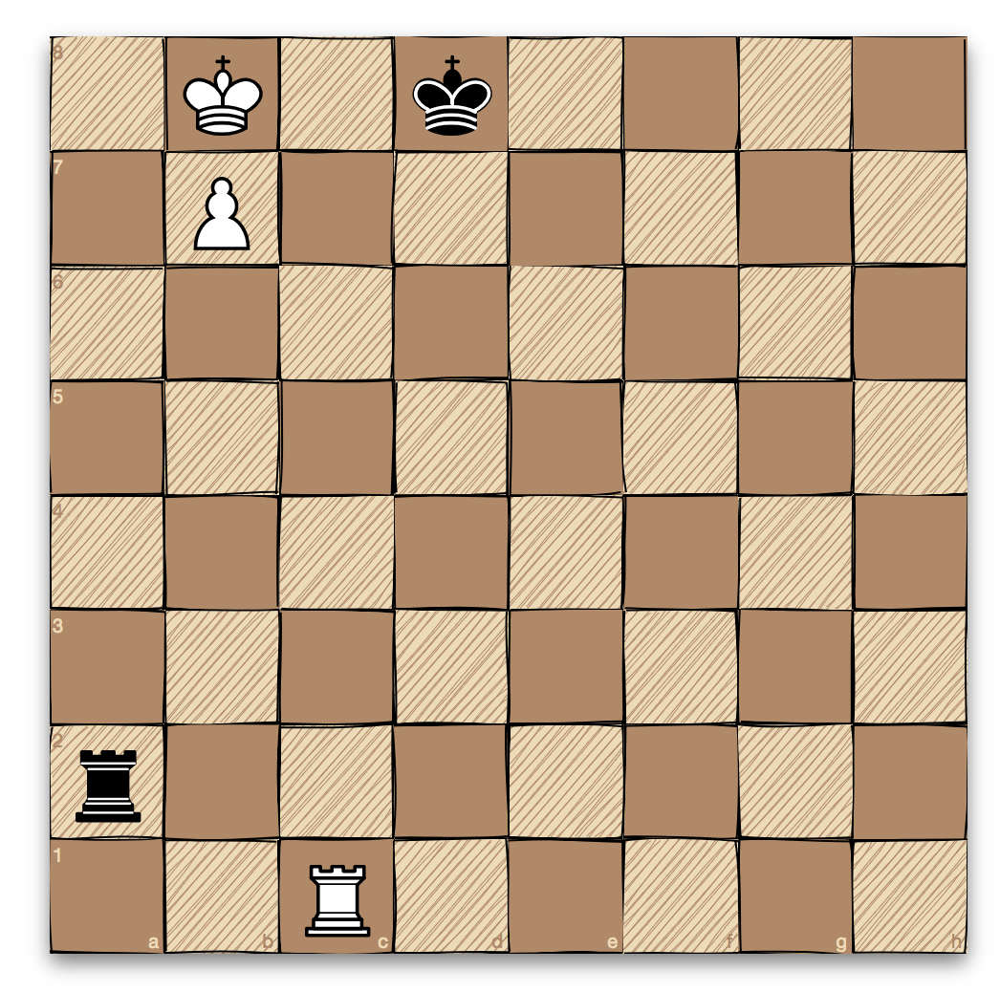
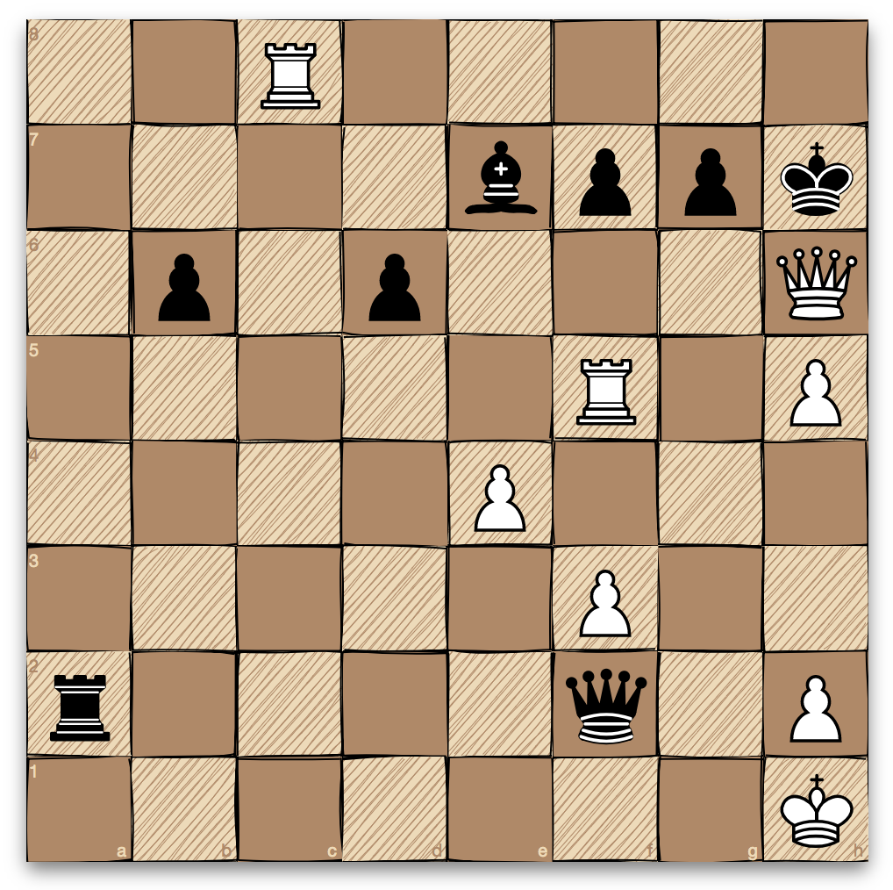
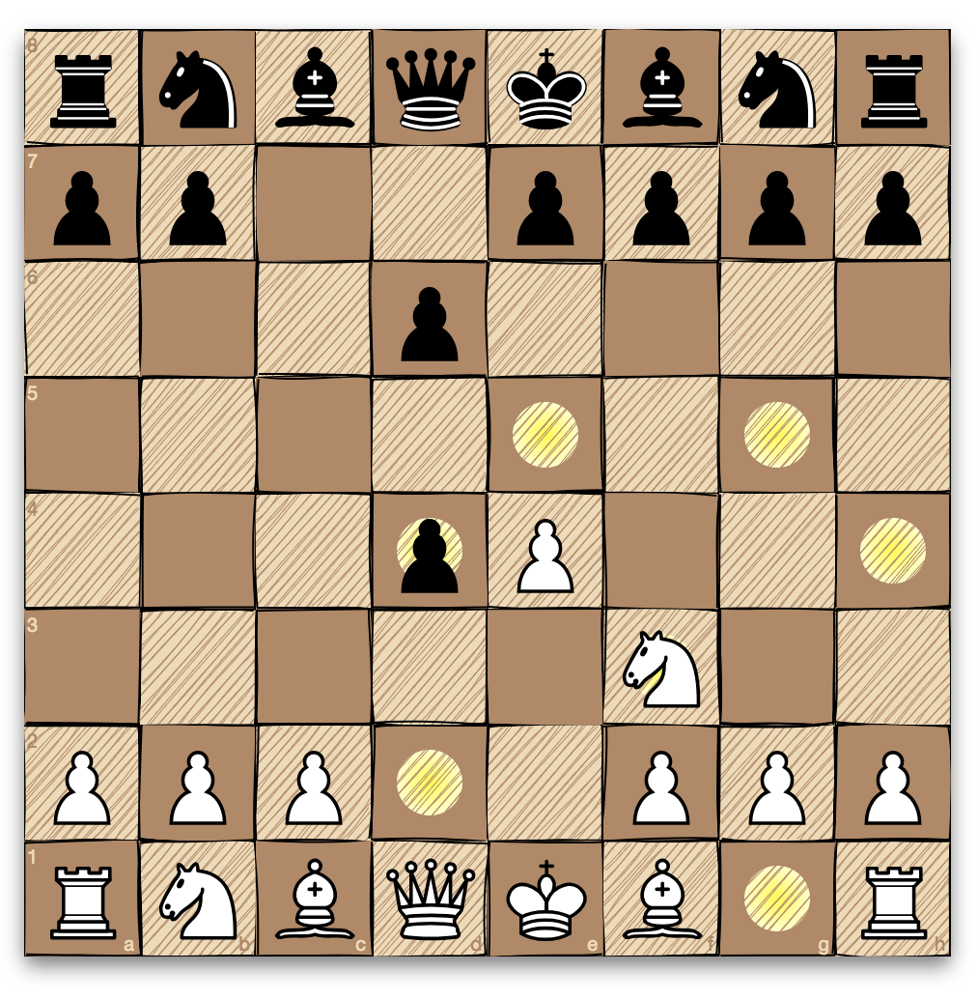

# Client Chess React 

To Do:
Finish API


<div align="center" markdown="1">





**A chessboard for React inspired by [chessboard.js](https://github.com/oakmac/chessboardjs)**

[![Build Status][build-badge]][build]
[![Code Coverage][coverage-badge]][coverage]
[![PRs Welcome][prs-badge]][prs]
[![version][version-badge]][package]
[![MIT License][license-badge]][license]
[![Commitizen friendly][commitzen-badge]][commitzen]
[![semantic-release][semantic-release-badge]][semantic-release]

</div>


## Installation

This module is distributed via [npm][npm] which is bundled with [node][node] and
should be installed as one of your project's `dependencies`:

```
npm install --save chessboardjsx
```

The package also depends on [React](https://reactjs.org/). Make sure you have that installed as well.

## Usage

* [Props](https://www.chessboardjsx.com/props): get started with Chessboard.jsx
* [With move validation](https://www.chessboardjsx.com/integrations/move-validation): how to integrate [chess.js](https://github.com/jhlywa/chess.js)
* [Integrating with chess engines](https://www.chessboardjsx.com/integrations/stockfish): how to integrate with Stockfish, the ~~world's strongest~~ [world's second strongest](https://www.chess.com/news/view/google-s-alphazero-destroys-stockfish-in-100-game-match) chess engine
* [Custom](https://www.chessboardjsx.com/custom): customize the board and pieces
* [Original repository for chessboardjsx](https://www.chessboardjsx.com/custom): customize the board and pieces


## Based on Chessboard.jsx

### What is Chessboard.jsx?

Chessboard.jsx is a React component with a flexible "just a board" API modeled from [chessboard.js](https://github.com/oakmac/chessboardjs). It's compatible with touch as well as standard HTML5 drag and drop.
